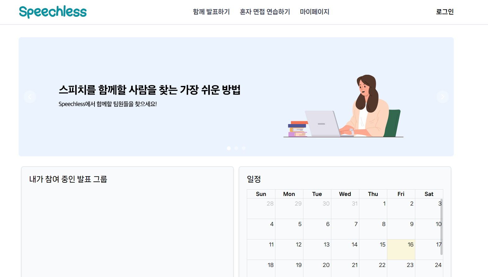
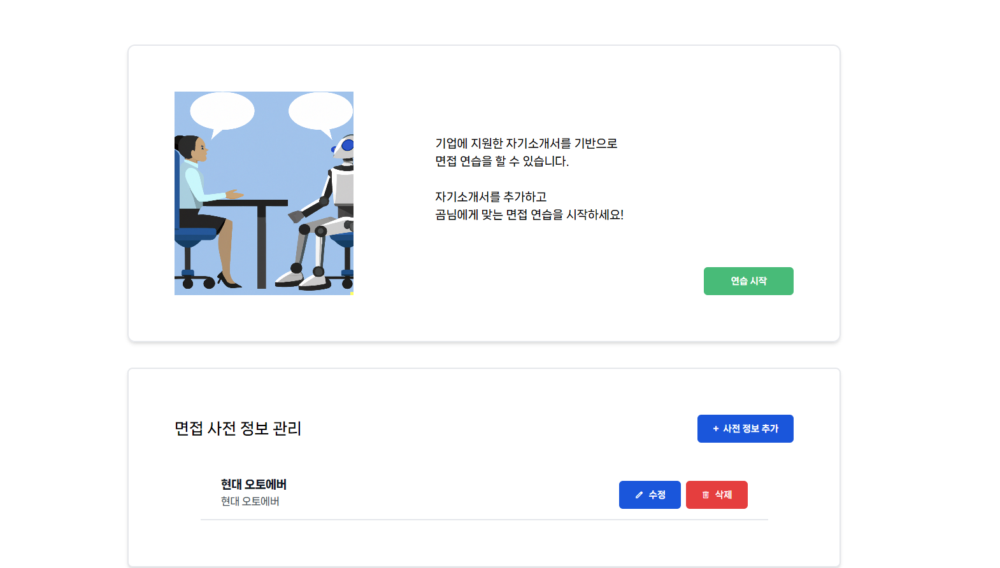
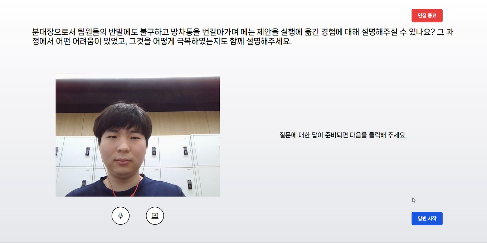
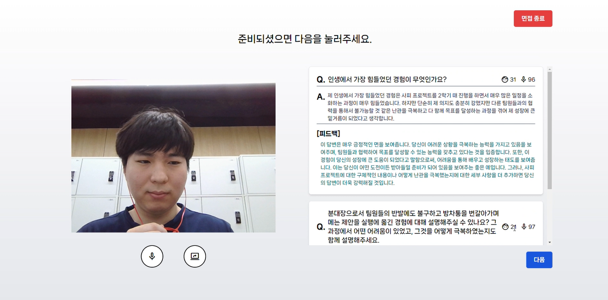
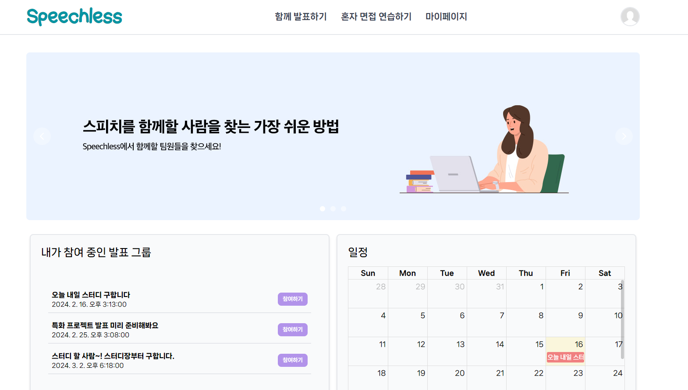
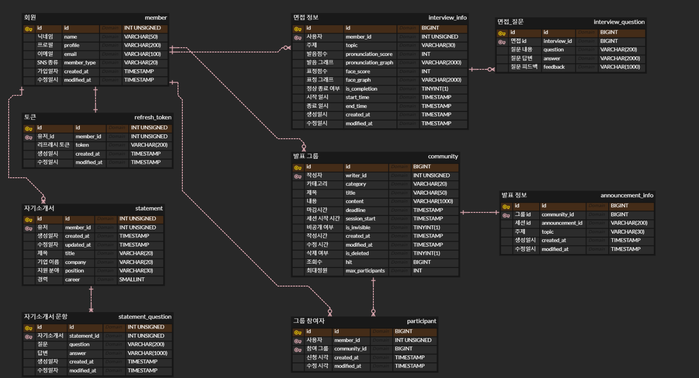

# 🙊 Speechless

> 사용자의 스피치 능력을 필요한 상황에 대비하여 혼자서 혹은 여러 명이 연습할 수 있도록 만든 프로젝트입니다.

## 목차

1. [기획 배경](#기획-배경)
2. [프로젝트 정보](#프로젝트-정보)  
2-1. [프로젝트 주요 기능](#1-프로젝트-주요-기능)  
2-2. [제작 기간](#2-제작-기간)  
2-3. [참여 인원](#3-참여-인원)  
2-4. [기술 스택](#4-기술-스택)  
2-5. [개발 환경 및 빌드 방법](#5-개발-환경-및-빌드-방법)  
2-6. [회고](#6-회고)
3. [라이센스]()
4. [추가 정보](#추가-정보)  
4-1. [깃 컨벤션](#git-컨벤션)  
4-2. [데이터베이스 스키마](#데이터베이스-스키마)  


<br/>
  
# 기획 배경
> <br/>
>
> - 팀 내에서 발표자 정할 때면 무섭지 않나요?
> - 시선이 집중되면 말이 잘 안나오지 않나요?
> - 준비하지 않은 돌발 질문이 두렵나요?  
> <br />

팀 프로젝트를 진행하면서 다른 역할은 분담이 쉽게 이뤄졌으나 다들 발표는 꺼려하는 문제가 있었습니다. 그래서 문득 저희 같은 사람들을 위한 프로젝트를 만들어 발표에 자신감을 얻을 수 있으면 좋겠다고 생각해 프로젝트를 시작했습니다.

<br/>

# 프로젝트 정보

## 1. 프로젝트 주요 기능

### 메인 페이지


### 로그인


### 혼자 면접 연습하기

#### 면접 화면 접속


#### 면접 시 AI로 생성된 질문


#### 면접 답변


#### 면접 시 AI로 생성된 피드백


### 면접 결과 리포트


### 함께 발표하기


### 연습 이력 확인


### 발표 연습 커뮤니티



### 프로젝트 인프라


## 2. 제작 기간
2024/01/08 ~ 2024/02/15

## 3. 참여 인원
### Front-End

|  |  |  | 
| :--------------------------------------------------------------------: | :------------------------------------------------------------------: | :---------------------------------------------------------------------: | 
|                 [김대현](https://github.com/Hyunnique)                 |                [한태희](https://github.com/nyanpasu-life)                 |                [윤길재](https://github.com/747Socker)                 |

### Back-End

|  |  |  | 
| :--------------------------------------------------------------------: | :------------------------------------------------------------------: | :---------------------------------------------------------------------: | 
|                 [배정훈](https://github.com/98-jeonghoon)                 |                [명소이](https://github.com/myeongsoyi)                 |                [이인석](https://github.com/insukL)                 |

<br/>

## 4. 기술 스택
### 공통 사용 기술
  
### Front-End
   

### Back-End
    

### 협업
     

## 5. 개발 환경 및 빌드 방법

Front-End와 Back-End 각 분야별로 /frontend, /backend 내 README 파일 확인

[Front-End README](./frontend/README.md)  
[Back-End README](./backend/README.md)

빌드 및 배포는 다음 파일 참조

[Infra](./Infra.md)

## 6. 회고

## 좋았던 부분

- 큰 마찰 없이 소통이 원활히 이어져서 좋았다
    - 피드백, 질문 등이 빠르게 이뤄져서 좋았음
- FE는 기술 스택을 빠르게 수정하며 빠른 판단을 통해 기술 부채로 인한 지연을 방지해서 좋았다

## 아쉬웠던 부분

- 기획 단계에서 메인 기능을 명확히 했어야 했는데, 기능이 분산되면서 인력이 제대로 집중되지 못했다
- 설계 단계에서 짚어야 했던 부분을 유예하면서 차후 결정 및 전파가 제대로 이뤄지지 못해 프로세스가 계속 지연됐다
- 짧은 시간 내에 진행된 프로젝트인데 반해 확실한 업무 분담과 병렬적인 기능 개발이 이뤄지지 못했다
- BE의 경우 시간 상 부득이하게 적용하지 못할 기술을 판단하여 제외했어야 했는데, 그러지 못하면서 생긴 지연이 아쉽다

# 라이선스

본 가이드는 [MIT](https://choosealicense.com/licenses/mit/) 라이선스 하에 공개합니다

* 공유 - 복제, 배포, 포맷 변경, 전송, 전시, 공연, 방송할 수 있습니다.
* 변경 - 리믹스, 변형, 2차적 저작물 작성 및 영리목적의 이용이 가능합니다. 

<br/>

# 추가 정보

### Git 컨벤션
---

#### 브랜치 컨벤션

- 기본적으로 git-flow 따름
    - JIRA를 사용하므로 feature 브랜치를 따로 두지 않고 JIRA 이슈 코드를 사용하여 브랜치 생성


| master | 최종 버전 관리 브랜치 |
| --- | --- |
| develop | 개발 버전 관리 브랜치 |
| develop-frontend | Front-End 개발 버전 관리 브랜치 |
| develop-backend | Back-End 개발 버전 관리 브랜치 |
| feature/{issue-num} | JIRA의 이슈에 해당하는 브랜치 (기능 개발 브랜치) |
- 개발 버전은 develop 브랜치에서 관리하되 규칙에 맞춰 develop 브랜치에서 분리하여 관리
    - develop-frontend : Front-End 개발 버전 브랜치
    - develop-backend : Back-End 개발 버전 브랜치
- 각 feature 브랜치에서 Gerrit을 통해 리뷰를 진행한 후, 1차적으로 분리된 develop 브랜치에 Merge 진행


#### 메시지 컨벤션

- 커밋 메시지는 아래의 양식을 따름
    - Merge 커밋의 경우 `[FE / BE / Infra]([JIRA 이슈 코드]) 상세 내용`의 양식으로 커밋

```
<타입>[적용 범위(선택사항)]: <설명>
[빈줄]
[본문 (선택사항)]
[빈줄]
[꼬릿말 (선택사항)]
```

- 메시지의 타입은 아래의 유형에서 하나를 선택하여 사용


| 헤더 명 | 내용 |
| --- | --- |
| feat | 새로운 기능 추가 |
| fix | 버그 수정 |
| chore | 그 외 자잘한 수정 (프로젝트 설정 등) |
| refactor | 코드 리팩토링 |
| test | 테스트 관련 코드 |
| docs | 문서 관련 |
| style | 코드 스타일 변경 (포매팅 수정, 들여쓰기 추가 등) |
| build | 빌드 관련 파일 수정 |
| perf | 성능 개선 |
| ci | CI 설정 파일 수정 |

### 데이터베이스 스키마
---


``` SQL
USE speechless;

DROP TABLE IF EXISTS `member`;

CREATE TABLE `member` (
	`id`	INT UNSIGNED	PRIMARY KEY	AUTO_INCREMENT,
	`name`	VARCHAR(50)	NULL,
	`profile`	VARCHAR(200)	NULL,
	`email`	VARCHAR(100)	NULL,
	`member_type`	VARCHAR(20)	NULL,
	`created_at`	TIMESTAMP	DEFAULT NOW(),
	`modified_at`	TIMESTAMP	DEFAULT NOW()
);

DROP TABLE IF EXISTS `refresh_token`;

CREATE TABLE `refresh_token` (
	`id`	INT UNSIGNED	PRIMARY KEY	AUTO_INCREMENT,
	`member_id`	INT UNSIGNED	NOT NULL,
	`token`	VARCHAR(200)	NULL,
	`created_at`	TIMESTAMP	DEFAULT NOW(),
	`modified_at`	TIMESTAMP	DEFAULT NOW(),
	FOREIGN KEY (`member_id`) REFERENCES `member` (`id`)
);

DROP TABLE IF EXISTS `community`;

CREATE TABLE `community` (
	`id`	BIGINT	PRIMARY KEY	AUTO_INCREMENT,
	`writer_id`	INT UNSIGNED	NOT NULL,
	`category`	VARCHAR(20)	NULL,
	`title`	VARCHAR(50)	NULL,
	`content`	VARCHAR(1000)	NULL,
	`deadline`	TIMESTAMP	NULL,
	`session_start`	TIMESTAMP	NULL,
	`is_invisible`	BIT(1)	NULL,
	`is_deleted`	BIT(1)	DEFAULT 0,
	`hit`	BIGINT	DEFAULT 0,
	`max_participants`	INT	DEFAULT 5,
	`created_at`	TIMESTAMP	DEFAULT NOW(),
	`modified_at`	TIMESTAMP	DEFAULT NOW(),
	FOREIGN KEY (`writer_id`) REFERENCES `member` (`id`)
);

DROP TABLE IF EXISTS `statement`;

CREATE TABLE `statement` (
	`id`	INT UNSIGNED	PRIMARY KEY	AUTO_INCREMENT,
	`member_id`	INT UNSIGNED	NOT NULL,
	`created_at`	TIMESTAMP	DEFAULT NOW(),
	`modified_at`	TIMESTAMP	DEFAULT NOW(),
	`title`	VARCHAR(20)	NULL,
	`company`	VARCHAR(20)	NULL,
	`position`	VARCHAR(30)	NULL,
	`career`	SMALLINT	NULL,
	FOREIGN KEY (`member_id`) REFERENCES `member` (`id`)
);

DROP TABLE IF EXISTS `statement_question`;

CREATE TABLE `statement_question` (
	`id`	INT UNSIGNED	PRIMARY KEY	AUTO_INCREMENT,
	`statement_id`	INT UNSIGNED	NOT NULL,
	`question`	VARCHAR(200)	NULL,
	`answer`	VARCHAR(1000)	NULL,
	`created_at`	TIMESTAMP	DEFAULT NOW(),
	`modified_at`	TIMESTAMP	DEFAULT NOW(),
	FOREIGN KEY (`statement_id`) REFERENCES `statement` (`id`)
);

DROP TABLE IF EXISTS `announcement_info`;

CREATE TABLE `announcement_info` (
	`id`	BIGINT	PRIMARY KEY	AUTO_INCREMENT,
	`community_id`	BIGINT	NOT NULL,
	`announcement_id`	VARCHAR(200)	NULL,
	`topic`	VARCHAR(30)	NULL,
	`created_at`	TIMESTAMP	DEFAULT NOW(),
	`modified_at`	TIMESTAMP	DEFAULT NOW(),
	FOREIGN KEY (`community_id`) REFERENCES `community` (`id`)
);

DROP TABLE IF EXISTS `interview_info`;

CREATE TABLE `interview_info` (
	`id`	BIGINT	PRIMARY KEY	AUTO_INCREMENT,
	`member_id`	INT UNSIGNED	NOT NULL,
	`topic`	VARCHAR(30)	NULL,
	`pronunciation_score`	INT	NULL,
	`pronunciation_graph`	VARCHAR(2000)	NULL,
	`face_score`	INT	NULL,
	`face_graph`	VARCHAR(2000)	NULL,
	`is_completion`	BIT(1)	DEFAULT 0,
	`start_time`	TIMESTAMP	NULL,
	`end_time`	TIMESTAMP	NULL,
	`created_at`	TIMESTAMP	DEFAULT NOW(),
	`modified_at`	TIMESTAMP	DEFAULT NOW(),
	FOREIGN KEY (`member_id`) REFERENCES `member` (`id`)
);

DROP TABLE IF EXISTS `interview_question`;

CREATE TABLE `interview_question` (
	`id`	BIGINT	PRIMARY KEY	AUTO_INCREMENT,
	`interview_id`	BIGINT	NOT NULL,
	`question`	VARCHAR(200)	NULL,
	`answer`	VARCHAR(2000)	NULL,
	`feedback`	VARCHAR(1000)	NULL,
	FOREIGN KEY (`interview_id`) REFERENCES `interview_info` (`id`)
);

DROP TABLE IF EXISTS `participant`;

CREATE TABLE `participant` (
	`id`	BIGINT	PRIMARY KEY	AUTO_INCREMENT,
	`member_id`	INT UNSIGNED	NOT NULL,
	`community_id`	BIGINT	NOT NULL,
	`created_at`	TIMESTAMP	DEFAULT NOW(),
	`modified_at`	TIMESTAMP	DEFAULT NOW(),
	FOREIGN KEY (`member_id`) REFERENCES `member` (`id`),
	FOREIGN KEY (`community_id`) REFERENCES `community` (`id`)
);
```